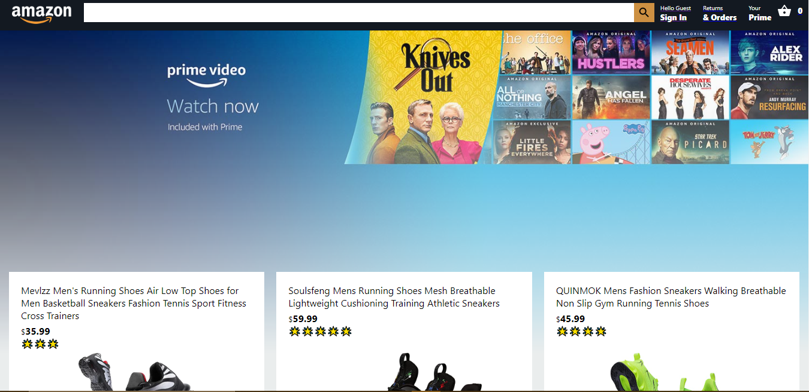

# Amazon Clone Using React js, Node js & Firebase

## Looking for a demo? Searh no more

[Preview the demo here](https://supaamazon.techfortified.com)

## About this project

This is the implementation of amazon clone using react.js, nodejs, firebase and stripe payment service. In this project, a user can be able to shop by adding items to cart and if the user is not logged in, the user can easily create an account before checking out. The order details are saved in the firebase database after payment has been made using stripe. The nodejs app is responsible for generating unique secret id for each order.

## Features 

Features include;

* Product display
* Firebase authentication and firebase firestore
* Add products to cart
* Order processing
* Stripe payment api integration
* Unique secret key generator using stripe and node js express framework
* Fetch & display client's orders based on unique user

### How run this project

To run this project, **read the README.md** files in both *client* & *server* directories.

